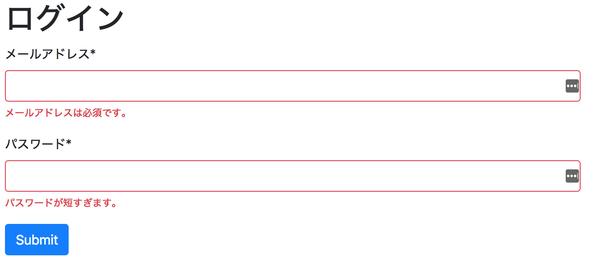
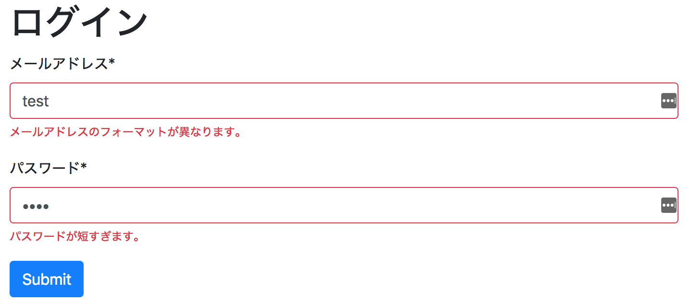
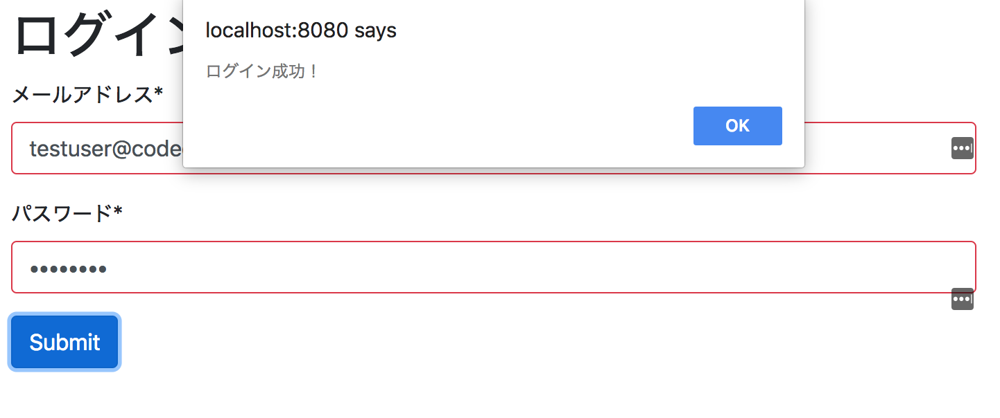

# レッスン6. フォーム

## 目的

- フォームの処理の仕方を知る。
- バリデーションの概念を理解する。
- 正規表現の基本を知る。

## フォームデータを扱う

フォームについてはHTMLのレッスンで既に学んできました。このレッスンでは、Javascriptを利用してフォームに入力された情報を受け取り、入力されたデータが妥当かどうかを確認し(バリデーション)、最後にデータストアに保存するまでの流れを説明していきます。今回は簡単に、ログインフォームを作ってみます。


## スターターファイル

- [codegrit-jp-students/js-unit02-lesson06-sample01-starter](https://github.com/codegrit-jp-students/js-unit02-lesson06-sample01-starter)


## フォーム提出の流れ

以下は、フォームデータの取得から提出の流れです。

1. 送信ボタンのクリックイベントが起こる。
2. フォームに入力された値を得る。
3. 得た値が妥当かどうかチェックする。
4. チェックした値が妥当で無ければエラーを表示する。
5. 値が妥当であれば、フォーム情報をサーバーに送信する。
6. サーバーから帰ってきたデータを表示する。

## server.js

今回のスターターファイルにはserver.jsというファイルが含まれています。このserver.jsはNode.jsとNode.js製のフレームワークExpress.jsを使って実装しています。

`npm run start`のコマンドで、このserver.jsと、webpack-dev-serverが同時に立ち上がり、`http://localhost:3000/login/`というルートで仮想的にログイン機能を試せるようにしています。

今回は、以下のメールアドレスとパスワードのみ受け付けるようにしています。

- メールアドレス: testuser@codegrit.jp
- パスワード: password

メールアドレスとパスワードをfetchで送信し、ログイン成功時には、ステータスコード200で、以下のオブジェクトをJSON化したものが返ります。

```javascript
{
  "id": 1,
  "name": "Code Grit",
  "email": "testuser@codegrit.jp",
  "message": "ログイン成功！"
}
```

ログイン失敗時には、ステータスコード403で以下のオブジェクトをJSON化したものが返ります。

```javascript
{
  message: "ログイン失敗"
}
```

では、ここからはフロントエンド側のコードを実際に書いていきましょう。

## HTMLフォームを作成する


今回使用するHTMLフォームはこちらです。

*index.html*
```html
<!DOCTYPE html>
<html>
<head>
  <meta charset="UTF-8">
  <link href="https://maxcdn.bootstrapcdn.com/bootstrap/4.0.0/css/bootstrap.min.css" rel="stylesheet" integrity="sha384-Gn5384xqQ1aoWXA+058RXPxPg6fy4IWvTNh0E263XmFcJlSAwiGgFAW/dAiS6JXm" crossorigin="anonymous">
</head>
<body>
  <Header>
    <div class="container-fluid">
      <div class="col">
        <h1>ログイン</h1>
      </div>
    </div>
  </Header>
  <div id="main">
    <div class="container-fluid">
      <div class="col">
        <div class="form-group">
          <label for="email">メールアドレス*</label>
          <input type="text" class="form-control" id="email">
        </div>
        <div class="form-group">
          <label for="password">パスワード*</label>
          <input type="password" class="form-control" id="password">
        </div>
        <button id="submit" type="submit" class="btn btn-primary">ログインする</button>
      </div>
    </div>
  </div>
  <script src="./bundle.js"></script>
</body>
</html>
```

## 送信ボタンへのclickイベントで、onSubmitファンクションを呼び出す

フォーム提出の流れの部分に書いた通り、まずは送信ボタンに対するクリックイベントに対応するためaddEventListnerを使います。

*/src/index.js*
```javascript
/* src/index.js */

{ //即時関数
  const submit = document.getElementById('submit'); // 送信ボタンの要素を指定する
  submit.addEventListener('click', onSubmit); // 送信ボタンがクリックされるとonSubmitを呼び出す。
}
```

上記のように、送信ボタンのクリックでonSubmitというファンクションを呼び出してフォームのデータを処理していきます。ここからはonSubmitファンクションを実装していきましょう。

## フォームに入力されたデータを取得する

上記で、メールアドレス用のInput要素と、パスワード用のInput要素それぞれのidに"email"、"password"を使用しています。そこで、これらのDOM要素は以下のようにして選択することが出来ます。

```javascript
const onSubmit = () => {
  let emailInput = document.getElementById('email');
  let passwordInput = document.getElementById('password');
}
```

input要素に入力された値を得るためには要素の`value`プロパティにアクセスします。

```javascript
const onSubmit = () => {
  let emailInput = document.getElementById('email');
  let passwordInput = document.getElementById('password');
  let emailVal = emailInput.value;
  let passwordVal = passwordInput.value;
}
```

これで値を取得しましたが、この2つの値が妥当かどうかチェックする必要があります。このチェックのことをプログラミング用語でバリデーションと呼びます。バリデーションの書き方は色々とあるのですが、今回は前回学習したClassを利用して実装していきます。

## BaseValidatorクラスを作成する

メールアドレスもパスワードも、中身が空の場合は妥当ではありません。そこで、中身が空でないかどうかをチェックするBasiValidatorクラスを作成します。今回はsrc直下にlibというディレクトリを作成してこの中にクラスを作成していきます。

まずは、クラスを定義します。

```javascript
/*  ./src/lib/BaseValidator.js */

class BaseValidator {
  constrcutor() {}
  _cannotEmpty() {}
}

export default BaseValidator;
```
または
```javascript
export default class {
  constrcutor() {}
  _cannotEmpty() {}
}
```

このように`_cannotEmpty`というインスタンスメソッドを作成して、ここで値があるかどうかチェックします。空でないかチェックした後には他のバリデーションを行いますので、バリデーションの結果をPromiseで返します。

ここで、空かどうかをチェックするテクニックとして`!!`を利用します。これを利用すると、値がNaNやundefinedの場合、空白文字の場合もfalseが返ってきます。

```javascript
let val1 = NaN;
let val2 = undefined;
let val3 = [];
let val4 = "";
let val5 = "not empty";

console.log(val1) // false
console.log(val2) // false
console.log(val3) // false
console.log(val4) // false
console.log(val5) // true
```

すると以下のように定義することが出来ます。

```javascript
class BaseValidator {
  constrcutor(type, val) {
    this.type = type; // メールアドレスあるいはパスワード
    this.val = val;
  }
  _cannotEmpty() {
    return new Promise((resolve, reject) => {
      if (!!this.val) {
        // 次のバリデーションへと繋げる
        resolve()
      } else {
        // 値が空のためエラーメッセージを含むオブジェクトを返す。
        reject({
          success: false,
          message: `${this.type}は必須です。`
        })
      }
    })
  }
}
```

## メールアドレスのバリデーションを行う

次にメールアドレスをバリデーションするために`MailValidator`というクラスを作成していきます。このMailValidatorクラスはBaseValidatorクラスを親として持ちます。superクラスのコンストラクタを利用して初期化するため、以下のように定義しましょう。またバリデーションにはvalidateというメソッドを利用するのでこれも併せて定義します。

```javascript
/* ./src/lib/MailValidator.js */

import BaseValidator from './BaseValidator';

class MailValidator extends BaseVallidator {
  constructor(val) {
    super(val, "メールアドレス"); // superクラスのコンストラクタを呼び出す。
  }
  validate() {}
}
```

## validateメソッドを実装する

さて、ここからvalidateメソッドを実装していくのですが、メールアドレスについて何をチェックすれば良いのでしょうか？ 一つ思い当たるのは`@`があるかどうかだと思います。またメールアドレスの末尾には`.jp`や`.com`のように`.`とTLD(トップレベルドメイン)が付きますのでこれもチェックする必要があります。こうした文字列にどういった文字が含まれているかなどをチェックしたい場合は**正規表現**を使います。

## 正規表現とは

正規表現とは、文字列内で文字の組み合わせを照合するために用いられるパターンです。英語ではRegular Expressionといいます。Javascriptでは正規表現(RegExp)オブジェクトを利用して正規表現を処理します。

RegExpオブジェクトは、正規表現リテラルを用いるか、あるいはコンストラクタ関数を利用して作成することが出来ます。

```javascript
// 正規表現リテラル利用。この場合パターンの左右をスラッシュ/で囲みます。
const re = /[a-z]+/;

// コンストラクタ関数を利用
const re = new RegExp('[a-z]+');
```

上記で、`[a-z]+`の部分は何を意味しているかというと、`[a-z]`の部分は小文字のアルファベットを示し、`+`の部分は一文字以上それが続くことを示しています。

文字列中で、パターンが合致する部分があるかどうかをチェックするには`test`とうインスタンスメソッドを利用します。

```javascript
let str1 = "ABC";
let str2 = "Abc";

console.log(re.test(str1)); // false
console.log(re.test(str2)); // true
```

上記のように、str2は"bc"というアルファベットの小文字が続いているため、`re`で指定したパターンとマッチします。

### 正規表現のパターン

正規表現で利用するパターンには以下のようなものがあります。

- **^** - 文字列の先頭を表します。例えば`^[a-z]+`の場合は先頭のすぐ後にアルファベットの小文字が1文字以上来ることを表します。

```javascript
const re = /^[a-z]+/

let str1 = "abc";
let str2 = "Abc";

console.log(re.test(str1)); // true
console.log(re.test(str2)); // false
```

- **$** - 文字列の末尾を表します。例えば`[a-z]$`は、文字列の末尾が小文字のアルファベットであることを表します。

```javascript
const re = /[a-z]+$/;

let str1 = "abC";
let str2 = "Abc";

console.log(re.test(str1)); // false
console.log(re.test(str2)); // true
```

- **x|y** - xまたはyに合致することを表します。

```javascript
const re = /(xyz|abc)$/; // 末尾がabcまたはxyzなら合致

let str1 = "abcabc";
let str2 = "abcdef";
let str3 = "abcxyz";

console.log(re.test(str1)); // true
console.log(re.test(str2)); // false
console.log(re.test(str3)); // true
```

- [] - 【】内のいずれかの文字を表します。例えば[a-zA-Z]は小文字か大文字のアルファベットを表しますが、数字や表しません。数字を表したい場合は[0-9]とします。


```javascript
const re = /[A-Z0-9]$/; // 末尾が大文字のアルファベットか数字なら合致

let str1 = "abc";
let str2 = "abC";
let str3 = "abc1";

console.log(re.test(str1)); // false
console.log(re.test(str2)); // true
console.log(re.test(str3)); // true
```

### フラグ

また、正規表現を指定する際にフラグを用いることでより高度な検索を行うことが出来ます。フラグは以下のようにして指定します。例えば以下では大文字と小文字を区別しないiというフラグを指定しています。

```javascript
const re = /[a-z]+/i

let str1 = "abc";
let str2 = "ABC";

console.log(re.test(str1)); // true
console.log(re.test(str2)); // true
```


正規表現については、それだけで一冊の本が書ける内容であり、また必要がある時に勉強するという手法を取るのが良いかと思いますので、このレッスンではこの程度にとどめます。今後、プログラムを書いていく中で文字列のパターン合致が必要になった時に更に詳しく勉強することを推奨します。


## メールアドレスのフォーマットをチェックする

メールアドレスはよく使うものですので、既によく吟味されたパターンが公開されています。今回はそうしたパターンの一つを使います。

```javascript
const re = /^([^@\s]+)@((?:[-a-z0-9]+\.)+[a-z]{2,})$/i;
```

このパターンを利用して、_checkFormatファンクションを実装していきます。


```javascript

import BaseValidator from './BaseValidator';

class MailValidator extends BaseVallidator {
  constructor(val) {
    super(val, "メールアドレス"); // superクラスのコンストラクタを呼び出す。
  }
  _checkFormat() {
    const re = /^([^@\s]+)@((?:[-a-z0-9]+\.)+[a-z]{2,})$/i; // 正規表現
    const match = re.test(this.val); // マッチするならtrue、しないならfalseを返す。
    if (match) {
      return Promise.resolve();
    } else {
      return Promise.reject({
        success: false,
        message: `${this.type}のフォーマットが異なります。`
      })
    }
  }
}
```

## validateファンクションを実装する

checkFormat関数が実装出来たので、MailValidatorのvalidate関数を実施していきます。validateファンクションでは、BaseValidatorの`_cannotEmpty`ファンクションで空白でないかチェックし、その後アドレスのフォーマットを先ほど実装した`_checkFormat`ファンクションで調べ、Promiseオブジェクトを返します。BaseValidatorはMailValidatorの親クラスのため、`super.ファンクション名`という形式でファンクションを呼び出します。

```javascript
import BaseValidator from './BaseValidator';

class MailValidator extends BaseVallidator {
  constructor(val) {
    super(val, "メールアドレス"); // superクラスのコンストラクタを呼び出す。
    this._checkFormat = this._checkFormat.bind(this);
  }
  validate() {
    return super._cannotEmpty()
      .then(this._checkFormat)
      .then((res) => {
        return { success: true }; // Promise.resolve({ success: true })と同一
      })
      .catch(err => {
        return err; // Promise.resolve(err)と同一
      });
  }
  _checkFormat() {...}
}
```

## PasswordValidatorの実装

パスワードのバリデーションにはPasswordValidatorというクラスを利用します。実際のアプリケーションでは場合に応じて、最低でも大文字や記号が一文字含まれているかどうかチェックするなどが必要になってきます。今回は簡単のために文字列の長さが最低8文字以上であることをチェックする`_checkLengthファンクション`のみを定義します。validateファンクションは、MailValidatorクラスとほぼ同一です。

```javascript
import BaseValidator from './BaseValidator';

export default class extends BaseValidator {
  constructor(val) {
    super(val, 'パスワード');
    this._checkLength = this._checkLength.bind(this);
  }
  validate() {
    return super._cannotEmpty()
      .then(this._checkLength)
      .then((res) => {
        return { success: true }; // Promise.resolve({ success: true })と同一
      })
      .catch(err => {
        return err; // Promise.resolve(err)と同一
      });
  }
  _checkLength() {
    if (this.val.length >= 8) {
      return Promise.resolve();
    } else {
      return Promise.reject({
        success: false,
        message: `パスワードが短すぎます。`
      });
    }
  }
}
```

## index.jsのvalidateメソッドを実装する

ここまでで、Validatorクラスを定義しフォームデータのバリデーションを行う準備が整いました。index.jsに戻りメールアドレスとパスワードをバリデーションするためのvalidateファンクションを定義していきましょう。

validateメソッドでは、メールアドレスとパスワードの2つの妥当性を先ほど定義したValidatorクラスで確認して、結果をProm伊勢オブジェクトで返します。今回は、Promiseのレッスンで学んだ`Promise.all`メソッドを利用しましょう。

```javascript
import MailValidator from './lib/MailValidator';
import PasswordValidator from './lib/PasswordValidator';

const validate = (email, password) => {
  const mailValidator = new MailValidator(email);
  const passwordValidator = new PasswordValidator(password);
  return Promise.all([
    mailValidator.validate(),
    passwordValidator.validate()
  ]);
}

const onSubmit = () => {...}
```

## onSubmitファンクションからvalidateファンクションを呼び出す。

次に先ほどのonSubmitファンクションからvalidateファンクションを呼び出し、結果を処理していきます。onSubmit内で、validateの結果を待つ必要があるので、onSubmitはasyncファンクションへと変えます。

```javascript
...

const onSubmit = async () => {
  let emailInput = document.getElementById('email');
  let passwordInput = document.getElementById('password');
  let emailVal = emailInput.value;
  let passwordVal = passwordInput.value;
  const results = await validate(emailVal, passwordVal);
  if (results[0].success && results[1].success) {
    // バリデーション成功、ログインファンクションを呼び出す。
  } else if (results[0].success) {
    // パスワードのバリデーションに失敗
  } else if (results[1].success) {
    // メールアドレスのバリデーションに失敗
  }
    // メールアドレス、パスワード共にバリデーション失敗
  }
}
```

## サイトにエラーメッセージを表示する。

上記でバリデーション失敗した場合、ユーザーにそのことが伝わるようにしないといけません。そのために`addErrorMessage`ファンクションを実装して、サイトが更新されるようにしましょう。エラーメッセージの表示には、Bootstrapの`is-invalid`をinput要素のクラスに加え、input要素の後に`invalid-feedback`というクラスを持つdiv要素とエラーメッセージを追加します。(詳しくは[Bootstrapドキュメント内の説明](https://getbootstrap.com/docs/4.0/components/forms/#validation)をご覧ください。)

```javascript
const addErrorMessage = (type, message) => {
  let input = document.getElementById(type); // メールアドレスなら"email"、パスワードなら"password"がタイプに入る
  let val = input.val;
  input.classList.add('is-invalid'); // input要素のクラスに`is-invalid`を追加する。
  input.insertAdjacentHTML('afterend', `<div class="invalid-feedback">${message}</div>`); //input要素の後にエラーメッセージを表示する。 
}
```

onSubmitファンクションにaddErrorMessageファンクションを追加します。

```javascript
const addErrorMessage = (type, message) => {...};

const onSubmit = async () => {
  let emailInput = document.getElementById('email');
  let passwordInput = document.getElementById('password');
  let emailVal = emailInput.value;
  let passwordVal = passwordInput.value;
  const results = await validate(emailVal, passwordVal);
  if (results[0].success && results[1].success) {
    // バリデーション成功
  } else if (results[0].success) {
    addErrorMessage("password", results[1].message)
  } else if (results[1].success) {
    addErrorMessage("email", res[0].message);
  }
    addErrorMessage("email", res[0].message);
    addErrorMessage("password", res[1].message);
  }
}
```

実装出来たら、実際にフォームにバリデーションの失敗するデータを入力して試してみましょう。

```bash
$ yarn run start
...
Project is running at http://localhost:8080/
...
```

`http://localhost:8080/`を開いて、フォームに情報を入力して送信ボタンを押すとメッセージが表示されるはずです。しかし、ここで喜ぶのはまだ早いです。試しにもう一度送信ボタンを押してみましょう。すると、どんどんとエラーメッセージが追加されていってしまいます。また、妥当な情報を入力して再度送信ボタンを押してもエラーメッセージが消えません。この2つのバグを修正していきましょう。


## 送信ボタンが押されたらerrorを一旦取り除く

先ほど説明したバグを解決するために、送信ボタンが押されたらエラーメッセージを一旦取り消すファンクション`removeErrors`を実装します。

```javascript
const removeErrors = () => {
  return new Promise((resolve) => {
    // .is-invalidのついた要素を全て探し出し、.is-invalidを外す。
    document.querySelectorAll('.is-invalid').forEach((el) => {
      el.classList.remove('.is-invalid');
    })
     // .invalid-feedbackのついた要素を全て探し出し、要素自体を消去する。
    document.querySelectorAll('.invalid-feedback').forEach((el) => {
      el.parentNode.removeChild(el);
    })
    resolve();
  })
}
```

このremoveErrorsファンクションを、onSubmitメソッドで最初に呼び出します。

```javascript
const onSubmit = async () => {
  await removeErrors()
  ...
}
```

再度、サイト上で送信ボタンを教えて見て下さい。エラーメッセージの重複表示が無くなり、正しい情報を入力したらエラーメッセージが消えるようになったはずです。

- 未入力の場合



- バリデーション失敗時




## サーバーにデータを送信する

次に、フォームに入力されたデータをサーバーに送信しなければなりません。これには、レッスン3で学んだfetch APIを利用します。まずは、fetch APIのpolyfillである`whatwg-fetch`パッケージをyarnを利用して追加します。

```bash
$ yarn add whatwg-fetch
```

追加したら、index.js内で、loginのためのファンクションを実装していきましょう。サーバー側のコードはプロジェクトフォルダのserver.jsから確認出来ますので興味のある方はご覧下さい。

```javascript

import fetch from 'whatwg-fetch';

const endpoint = 'http://localhost:3000';

const login = (email, password) => {
  return new Promise((resolve, reject) => {
    fetch(`${endpoint}/login`, {
      method: 'post',
      headers: {
        Accept: 'application/json',
        'Content-Type': 'application/json',
      },
      body: JSON.stringify({
        email: email,
        password: password
      })
    })
    .then((res) => {
      const json = res.json();
      if (res.status === 200) { // ログイン成功
        return json
      } else { // ログイン失敗
        return Promise.reject(new Error('ログイン失敗'))
      }
    })
  })
}
```

上記のコードでは、fetchAPIを利用してログインルートにPOSTメソッドでメールアドレスとパスワードを送信しています。

次にサーバー側から戻ってきたresponseのレスポンスボディ部分のJSONデータにres.json()というファンクションでアクセスし、これを返しています。

## ログインの結果を処理する

最後にloginファンクションの結果をonSubmitファンクション上で処理していきます。

```javascript

const onSubmit = async () => {
  await removeErrors()
  let emailInput = document.getElementById('email');
  let passwordInput = document.getElementById('password');
  let emailVal = emailInput.value;
  let passwordVal = passwordInput.value;
  const results = await validate(emailVal, passwordVal);
  if (results[0].success && results[1].success) {
    login(emailVal, passwordVal)
    .then((json) => {
      alert(json.message);
    })
    .catch((err) => {
      alert(err.message);
    });
  } else if (results[0].success) {
    addErrorMessage("password", results[1].message);
  } else if (results[1].success) {
    addErrorMessage("email", results[0].message);
  } else {
    addErrorMessage("password", results[1].message);
    addErrorMessage("email", results[0].message);
  }
}
```

これで必要な機能が全て実装完了しました。

## 実際に動かす

さて、ここまで完成したら実際に動かしましょう。バリデーションエラーメッセージの表示、正しいパスワードでログイン成功、誤ったパスワードでのログイン失敗のアラート表示がそれぞれあれば成功です。



## 完成版のコード

- [codegrit-jp-students/js-unit02-lesson06-sample01-final](https://github.com/codegrit-jp-students/js-unit02-lesson06-sample01-final)

## チャレンジ

- [チャレンジ6](./challenge/README.md)

## 更に学ぼう

### 記事で学ぶ


