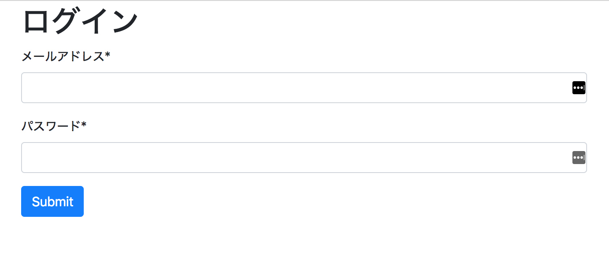

## HTMLフォームを作成する



今回使用するHTMLフォームはこちらです。

*index.html*
```html
<!DOCTYPE html>
<html>
<head>
  <meta charset="UTF-8">
  <link href="https://maxcdn.bootstrapcdn.com/bootstrap/4.0.0/css/bootstrap.min.css" rel="stylesheet" integrity="sha384-Gn5384xqQ1aoWXA+058RXPxPg6fy4IWvTNh0E263XmFcJlSAwiGgFAW/dAiS6JXm" crossorigin="anonymous">
</head>
<body>
  <Header>
    <div class="container-fluid">
      <div class="col">
        <h1>ログイン</h1>
      </div>
    </div>
  </Header>
  <div id="main">
    <div class="container-fluid">
      <div class="col">
        <div class="form-group">
          <label for="email">メールアドレス*</label>
          <input type="text" class="form-control" id="email">
        </div>
        <div class="form-group">
          <label for="password">パスワード*</label>
          <input type="password" class="form-control" id="password">
        </div>
        <button id="submit" type="submit" class="btn btn-primary">ログインする</button>
      </div>
    </div>
  </div>
  <script src="./bundle.js"></script>
</body>
</html>
```

## 送信ボタンへのclickイベントで、onSubmitファンクションを呼び出す

フォーム提出の流れの部分に書いた通り、まずは送信ボタンに対するクリックイベントに対応するためaddEventListnerを使います。

*/src/index.js*
```javascript
/* src/index.js */

{ //即時関数
  const submit = document.getElementById('submit'); // 送信ボタンの要素を指定する
  submit.addEventListener('click', onSubmit); // 送信ボタンがクリックされるとonSubmitを呼び出す。
}
```

上記のように、送信ボタンのクリックでonSubmitというファンクションを呼び出してフォームのデータを処理していきます。ここからはonSubmitファンクションを実装していきましょう。

## フォームに入力されたデータを取得する

上記で、メールアドレス用のInput要素と、パスワード用のInput要素それぞれのidに"email"、"password"を使用しています。そこで、これらのDOM要素は以下のようにして選択することが出来ます。

```javascript
const onSubmit = () => {
  let emailInput = document.getElementById('email');
  let passwordInput = document.getElementById('password');
}
```

input要素に入力された値を得るためには要素の`value`プロパティにアクセスします。

```javascript
const onSubmit = () => {
  let emailInput = document.getElementById('email');
  let passwordInput = document.getElementById('password');
  let emailVal = emailInput.value;
  let passwordVal = passwordInput.value;
}
```

これで値を取得しましたが、この2つの値が妥当かどうかチェックする必要があります。このチェックのことをプログラミング用語でバリデーションと呼びます。バリデーションの書き方は色々とあるのですが、今回は前回学習したClassを利用して実装していきます。

## BaseValidatorクラスを作成する

メールアドレスもパスワードも、中身が空の場合は妥当ではありません。そこで、中身が空でないかどうかをチェックするBasiValidatorクラスを作成します。今回はsrc直下にlibというディレクトリを作成してこの中にクラスを作成していきます。

まずは、クラスを定義します。

```javascript
/*  ./src/lib/BaseValidator.js */

class BaseValidator {
  constrcutor() {}
  _cannotEmpty() {}
}

export default BaseValidator;
```
または
```javascript
export default class {
  constrcutor() {}
  _cannotEmpty() {}
}
```

このように`_cannotEmpty`というインスタンスメソッドを作成して、ここで値があるかどうかチェックします。空でないかチェックした後には他のバリデーションを行いますので、バリデーションの結果をPromiseで返します。

ここで、空かどうかをチェックするテクニックとして`!!`を利用します。これを利用すると、値がNaNやundefinedの場合、空白文字の場合もfalseが返ってきます。

```javascript
let val1 = NaN;
let val2 = undefined;
let val3 = [];
let val4 = "";
let val5 = "not empty";

console.log(val1) // false
console.log(val2) // false
console.log(val3) // false
console.log(val4) // false
console.log(val5) // true
```

すると以下のように定義することが出来ます。

```javascript
class BaseValidator {
  constrcutor(type, val) {
    this.type = type; // メールアドレスあるいはパスワード
    this.val = val;
  }
  _cannotEmpty() {
    return new Promise((resolve, reject) => {
      if (!!this.val) {
        // 次のバリデーションへと繋げる
        resolve()
      } else {
        // 値が空のためエラーメッセージを含むオブジェクトを返す。
        reject({
          success: false,
          message: `${this.type}は必須です。`
        })
      }
    })
  }
}
```

## メールアドレスのバリデーションを行う

次にメールアドレスをバリデーションするために`MailValidator`というクラスを作成していきます。このMailValidatorクラスはBaseValidatorクラスを親として持ちます。superクラスのコンストラクタを利用して初期化するため、以下のように定義しましょう。またバリデーションにはvalidateというメソッドを利用するのでこれも併せて定義します。

```javascript
/* ./src/lib/MailValidator.js */

import BaseValidator from './BaseValidator';

class MailValidator extends BaseVallidator {
  constructor(val) {
    super(val, "メールアドレス"); // superクラスのコンストラクタを呼び出す。
  }
  validate() {}
}
```

## validateメソッドを実装する

さて、ここからvalidateメソッドを実装していくのですが、メールアドレスについて何をチェックすれば良いのでしょうか？ 一つ思い当たるのは`@`があるかどうかだと思います。またメールアドレスの末尾には`.jp`や`.com`のように`.`とTLD(トップレベルドメイン)が付きますのでこれもチェックする必要があります。こうした文字列にどういった文字が含まれているかなどをチェックしたい場合は**正規表現**を使います。